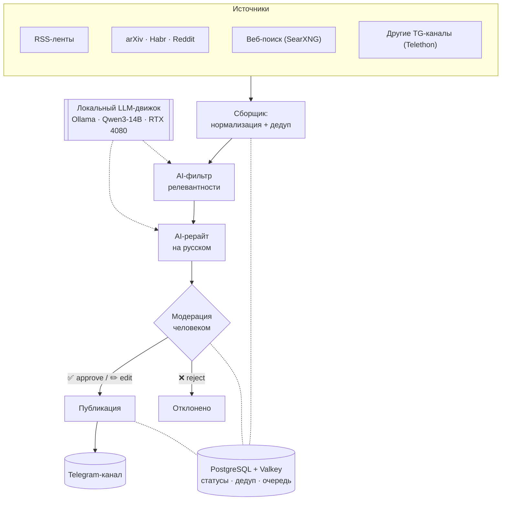

# Архитектура

Пайплайн собирает статьи из нескольких источников, отбирает и переписывает их локальной нейросетью на русском, а перед публикацией в Telegram-канал каждый пост проходит **проверку человеком**.

## Схема



## Компоненты

- **Сборщик** (`app/src/collectors`) — забирает материалы из RSS, arXiv, Habr, Reddit, веб-поиска (SearXNG) и Telegram-каналов (Telethon), чистит HTML и приводит к единому формату `{title, url, text, source, published_at}`.
- **Дедуп** (`app/src/dedup`) — отсекает повторы: сначала по URL/хешу, затем семантически по эмбеддингам (`bge-m3`).
- **AI-фильтр** (`app/src/filter`) — локальная LLM оценивает релевантность статьи (0–10) по тематике канала; ниже порога — отбрасывается.
- **AI-рерайт** (`app/src/rewrite`) — локальная LLM делает готовый пост: саммари на русском, заголовок, хэштеги, ссылка на источник, форматирование под Telegram.
- **Модерация** (`app/src/moderation`) — бот (`aiogram`) присылает черновик админу в личку с кнопками ✅ / ✏️ / ❌.
- **Публикация** (`app/src/publisher`) — после одобрения постит в канал через Bot API (разбивает длинные посты), сохраняет `message_id` и статус.
- **LLM-движок** (`app/src/llm`) — клиент к Ollama; на проде Qwen3-14B с GPU, на деве qwen3:4b нативно на Mac.
- **Хранилище** (`app/src/db`) — PostgreSQL (статьи, статусы, история дедупа) + Valkey (очередь, кэш).

## Поток данных и статусы

Каждая статья проходит по статусам:

```
new → filtered → drafted → pending → published | rejected
```

- `new` — только собрана; `filtered` — прошла порог релевантности;
- `drafted` — сгенерирован пост; `pending` — ждёт модерации;
- `published` / `rejected` — финальные состояния.

Статусы хранятся в PostgreSQL, что даёт идемпотентность (повторный запуск не дублирует посты) и историю для дедупа.

## Ключевые решения

- **Локальная нейросеть** (Ollama + Qwen3-14B) — без облачных API и оплаты за токены; русский язык держит хорошо, влезает в 16 ГБ VRAM RTX 4080.
- **Человек в цикле** — ничего не публикуется без подтверждения; снимает риски качества и авторских прав (публикуем саммари + ссылку, а не полный текст).
- **Valkey вместо Redis** — полностью открытый BSD-форк.
- **Docker-first** — один `docker compose` поднимает весь стек; разработка на Mac (Ollama нативно, без GPU), прод на Windows (Ollama в контейнере с пробросом GPU).

## Подробнее

- Стек, модели и развёртывание на Windows — [docs/architecture.md](docs/architecture.md)
- Структура репозитория, аудит лицензий, кросс-платформа Mac→Windows — [docs/repo-architecture.md](docs/repo-architecture.md)
